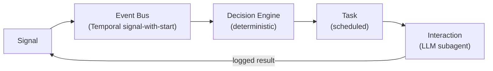

# Architecture

Mirenta runs on the **Takeoff Runtime** — an event-driven, durable-workflow architecture for agent work that spans days to weeks across voice, SMS, email. LLMs touch only the conversation surface; everything that decides _when, whether, and on what channel_ to act is deterministic code. That split is what makes long-running, multi-channel outreach predictable and auditable.

> **Implementation status.** The full loop — signal ingestion, the event bus (Temporal signal-with-start), the deterministic decision engine, durable task scheduling, and the interaction layer — runs end-to-end today for **SMS only**. Voice and email are real signal/task types in the schema with no ingestion route, execution path, or subagent behind them yet; proactive/first-touch outreach and auto-follow-up rules also don't exist yet. See [Component status](#component-status) for the precise breakdown.

## The loop

1. A **Signal** arrives (inbound webhook, reply, or a completed interaction re-entering the loop).
2. It's published to an **event bus**, partitioned by `contact_id` so one contact's events always process in order.
3. The **decision engine** — pure deterministic code, no LLM calls — reads the signal plus contact state and emits zero or more **tasks**.
4. The **task scheduler** durably fires each task at its scheduled time, minutes to weeks out.
5. The **interaction layer** runs an LLM subagent for that task on its channel, then logs the result and re-publishes it as a new `interaction_result` signal — closing the loop.

## Components

### 1 · Signal ingestion

FastAPI webhook routers normalize inbound events into the canonical `Signal` schema (`app/schemas/signals.py`, `signals` table) and hand them to the event bus. **Only `POST /webhooks/twilio/sms` exists today** (`app/api/routers/signals.py`) — it verifies the Twilio request signature, resolves the sending org via `organizations.phone` and the contact via `contacts.phone`, records the `inbound_sms` signal, and either handles STOP/START keywords synchronously (`app.services.sms_interaction.handle_sms_keyword_fastpath`) or hands off to the contact's `ContactLoopWorkflow`. `dedup_key` rejects provider webhook replays at the edge — see the `signals` unique constraint in `supabase/migrations/0004_signals.sql`. There is no inbound-call or inbound-email webhook yet, so `inbound_call`/`inbound_email` signals have a schema and nowhere to come from.

New organizations get a Twilio number provisioned automatically at creation (`provision_phone_number` in `app/services/twilio_client.py`, wired into `POST /organizations`) so `organizations.phone` — the field inbound SMS routes against — is populated without a manual step. This is best-effort: a Twilio failure doesn't fail org creation, and the number can be set manually afterward via `PATCH /organizations/{id}`.

### 2 · Event bus

Temporal **signal-with-start** on the contact's `ContactLoopWorkflow` (`id=f"contact-loop:{contact_id}"`): if the workflow is already running for that contact it's signaled in place, otherwise a new one is started. Signals queue inside the workflow (`ContactLoopWorkflow.signal_received`) and are processed one at a time in arrival order — this is what gives per-contact ordering without a separate message broker.

### 3 · Contact memory

Per-contact state lives in two places, both in the same Supabase Postgres project:

- **`contact_state`** (structured, mutable) — current decision-engine state, `goal`, consent-adjacent counters (`contact_attempts`, `attempts_window_start`), `next_task_at`, and the running `temporal_workflow_id`. This is what the decision engine reads on every signal.
- **`contact_memory`** (semantic) — embedded chunks (summaries, extracted facts, transcript excerpts) with pgvector HNSW recall via the `match_contact_memory` RPC (`supabase/migrations/0007_memory.sql`). Rolling summaries also get mirrored onto `contact_state.memory_summary` for cheap injection into agent context without a vector query.

Every decision reads from this state; every interaction writes back to it. This is what gives the agent continuity across weeks of touchpoints.

### 4 · Decision engine (deterministic core)

A rules engine in `decision/` — **not an LLM**, and with zero imports from `app/core/langgraph/` (see AGENTS.md's deterministic-core invariant). `evaluate(signal, contact, contact_state, consent, now)` (`decision/engine.py`) dispatches on `signal.type` to a handler in `decision/rules.py` and always emits the same `tasks` for the same inputs.

**Only two signal types are handled today:**

| `signal.type` | Handler | Behavior |
|---|---|---|
| `inbound_sms` | `decide_on_inbound_sms` | Runs the hard guardrails, then emits one `sms` reply task deferred past quiet hours if needed |
| `interaction_result` | `decide_on_interaction_result` | Folds the outcome into `contact_state` (`opted_out` / `goal_achieved` / `active`); **emits no tasks** — there's no auto-follow-up rule yet |

Every other `signal.type` (`webhook`, `inbound_call`, `inbound_email`, `portal_event`, `manual`) is a no-op — `evaluate()` returns an empty `DecisionOutput`. Two consequences worth knowing:

- **No proactive/first-touch outreach.** Every task today is emitted in response to an existing inbound signal. Nothing initiates contact with someone who hasn't signaled yet.
- **No task cancellation on supersession.** If a task is already scheduled and a newer signal makes it stale (e.g. the contact replies before a pending follow-up fires), nothing cancels the pending one — it still fires. `tasks.status` has a `canceled` value in its enum for this, but nothing sets it yet.

Compliance guardrails (`decision/guardrails.py`) are hard preconditions, not filters applied later: quiet hours (deferral, not a block), contact-frequency caps, DNC (`contacts.status = 'dnc'`), and the `current_consent` view (per-channel, latest-decision-wins — see `supabase/migrations/0003_contacts.sql`). A task that fails a guardrail check is never emitted, and `tasks.idempotency_key` is derived deterministically (`decision/idempotency.py`) so retries can't double-emit it.

### 5 · Task scheduler

Durable delayed execution via **Temporal** (`workflows/`) — one long-running `ContactLoopWorkflow` per contact, with a child `TaskExecutionWorkflow` per emitted task (`parent_close_policy=ABANDON`, so a task keeps running to completion independent of what else happens to the contact afterward). `TaskExecutionWorkflow` sleeps on a durable timer until `scheduled_for`, then **re-checks guardrails** (DNC, consent, frequency cap — not "has the contact already replied," see the decision-engine gap above) before doing anything, so a compliance change made while the task was sleeping still blocks the send. The `tasks` table (`supabase/migrations/0005_tasks.sql`) is the durable, queryable record — `temporal_workflow_id`/`temporal_run_id` link a row back to its workflow, `idempotency_key` guarantees a retried activity never double-sends, and `guardrail_result` records the precondition checks re-evaluated at execution time.

**Only `task.type == "sms"` actually executes.** Any other task type (`call`, `email`, `webhook`, `api_call`) hits `TaskExecutionWorkflow`'s type check and is marked `status="failed"` immediately — there's no send-side implementation for those channels yet (see §6).

Run the worker with `make worker` (registers `ContactLoopWorkflow` + `TaskExecutionWorkflow` and their activities — see `worker/main.py`); `make temporal-up` starts a local Temporal server + UI via `docker-compose.yml` for development.

### 6 · Interaction layer (LLM subagents)

Channel-specific LangGraph subagents, invoked from the `run_interaction` Temporal activity (`activities/interactions.py`) — the one file outside `app/core/langgraph/` allowed to import from it, keeping the deterministic/generative seam explicit.

- **SMS (`app/core/langgraph/sms_graph.py`)** — the only channel that's actually wired up. A `compose → output_guardrails` loop: `compose` drafts a reply with the LLM (`app/core/langgraph/nodes/compose.py`), `output_guardrails` deterministically checks it (max length, required "STOP" opt-out language, prohibited-claim keywords, PII patterns — `app/core/langgraph/nodes/output_guardrails.py`) and either passes it through, sends it back to `compose` with feedback (up to `MAX_GUARDRAIL_ATTEMPTS`), or escalates to a human. State is checkpointed via `AsyncPostgresSaver` keyed on `thread_id = f"sms:{org_id}:{contact_id}"`, so the LLM sees prior turns on the next inbound message. Every call is traced via the Langfuse `CallbackHandler`.
- **Voice (`app/core/langgraph/voice_graph.py`)** — exists as a class but runs the same generic chat/tool-call loop with no LiveKit/Twilio realtime wiring behind it; it can't actually take a call yet.
- **Email** — no subagent exists at all yet.

Both channel agents subclass `BaseChannelAgent` (`app/core/langgraph/base.py`), which provides the Postgres connection pool, checkpointer, and shared chat/tool-call plumbing; a channel only declares `agent_name`, `state_cls`, and `tools`, and overrides `create_graph()`/`_chat()` once its behavior diverges (SMS does; voice doesn't yet).

Every completed interaction is written to `interactions` (`supabase/migrations/0006_interactions.sql`) via the `log_interaction` activity, and `emit_interaction_result_signal` (`activities/logging.py`) writes a new `interaction_result` signal and signals it straight back into the same `ContactLoopWorkflow` — this is what actually closes the loop for SMS end-to-end.

The `contact_timeline` view merges `signals`, `tasks`, and `interactions` into one chronological feed per contact (`GET /organizations/{org_id}/contacts/{id}/timeline`), so reconstructing "everything that's happened with this contact" doesn't require querying three tables separately.

## Key design principles

- **Deterministic core, generative edge.** The decision engine has zero LLM calls and zero imports from the agent layer. Same inputs → same tasks, always. This is the predictability and audit guarantee the whole architecture is built around.
- **Compliance as preconditions, not filters.** Guardrails gate task _emission_ in the decision engine and are re-checked at _execution_ time (`tasks.guardrail_result`) — a non-compliant contact attempt is structurally impossible, not just discouraged. Consent is append-only (`consent` table, never updated in place — revoke is a new row) so the compliance trail can't be silently rewritten.
- **Everything is a Signal.** Inbound webhooks, replies, and completed interactions all re-enter through the same `signals` table and the same decision-engine entry point, so one code path handles the entire contact lifecycle from first touch to opt-out.
- **Full provenance.** Every task records the signal that caused it (`caused_by_signal_id`); every interaction records its task (`task_id`) and emits a result signal (`result_signal_id`) — an unbroken audit chain per contact, queryable via `contact_timeline`.

## Reference stack

| Layer                      | Technology                                                                     | Status                                                                                                       |
| --------------------------- | ------------------------------------------------------------------------------ | -------------------------------------------------------------------------------------------------------------------------------------------- |
| Signal ingestion           | FastAPI webhook routers → canonical `Signal`                                   | SMS done (`receive_twilio_sms`); voice/email webhooks not implemented                                        |
| Event bus                  | Temporal signal-with-start, partitioned per contact                            | Done                                                                                                          |
| Orchestration / scheduling | Temporal (one long-running workflow per contact; timers; child task workflows) | Done — `workflows/contact_loop.py`, `workflows/task_execution.py`, `worker/main.py`                          |
| Decision engine            | Pure Python rules + guardrails (runs inside workflow code)                     | Done for `inbound_sms`/`interaction_result`; no proactive outreach, no auto-follow-up, no task cancellation  |
| Subagents                  | LangGraph graphs per channel, invoked from Temporal activities                 | SMS done (`sms_graph.py`); voice is an unwired stub (`voice_graph.py`); no email subagent                    |
| State + memory             | Supabase Postgres (+ pgvector for semantic recall)                             | Done — `contacts`, `contact_state`, `consent`, `signals`, `tasks`, `interactions`, `contact_memory`          |
| Schemas                    | Pydantic models shared across API, workflows, and agents                       | Done — `app/schemas/`                                                                                        |

## Component status

| Component                                  | File(s)                                                                    | State                                                                 |
| ------------------------------------------ | -------------------------------------------------------------------------- | ---------------------------------------------------------------------- |
| Signal schema + table                      | `app/schemas/signals.py`, `supabase/migrations/0004_signals.sql`           | Implemented                                                            |
| Twilio SMS webhook                         | `app/api/routers/signals.py::receive_twilio_sms`                          | Implemented                                                            |
| Voice / email webhooks                     | —                                                                          | Not started                                                            |
| Contact state + consent                    | `app/schemas/contacts.py`, `supabase/migrations/0003_contacts.sql`         | Implemented                                                            |
| Task schema + table                        | `app/schemas/tasks.py`, `supabase/migrations/0005_tasks.sql`               | Implemented                                                            |
| Interaction schema + table + timeline view | `app/schemas/interactions.py`, `supabase/migrations/0006_interactions.sql` | Implemented                                                            |
| Contact memory + semantic recall RPC       | `app/schemas/memory.py`, `supabase/migrations/0007_memory.sql`             | Implemented                                                            |
| Temporal client + worker                   | `app/services/temporal_client.py`, `worker/main.py`                       | Implemented                                                            |
| Decision engine                            | `decision/engine.py`, `decision/rules.py`, `decision/guardrails.py`        | Implemented for `inbound_sms` + `interaction_result`; no other rules  |
| `ContactLoopWorkflow` / `TaskExecutionWorkflow` | `workflows/contact_loop.py`, `workflows/task_execution.py`            | Implemented for the `sms` task type                                   |
| SMS subagent                               | `app/core/langgraph/sms_graph.py`, `nodes/compose.py`, `nodes/output_guardrails.py` | Implemented                                                    |
| Voice subagent                             | `app/core/langgraph/voice_graph.py`                                       | Stub — no LiveKit/Twilio realtime wiring, not invoked from any task    |
| Email subagent                             | —                                                                          | Not started                                                            |
| Org phone auto-provisioning                | `app/services/twilio_client.py::provision_phone_number`                   | Implemented                                                            |
| Task cancellation on signal supersession   | —                                                                          | Not started (`tasks.status` has a `canceled` value nothing sets)       |
| Proactive/first-touch outreach             | —                                                                          | Not started                                                            |
| Auto-follow-up after silence               | —                                                                          | Not started (`decide_on_interaction_result` emits no tasks)            |

## Component responsibilities

| Component        | File                                       | Responsibility                                                                                        |
| ----------------- | ------------------------------------------- | -------------------------------------------------------------------------------------------------------- |
| Decision engine   | `decision/engine.py`, `decision/rules.py`   | `(signal, contact_state) -> tasks`; pure, no LLM calls, no `app.core.langgraph` imports                  |
| Guardrails        | `decision/guardrails.py`                    | Quiet hours, DNC, consent, frequency cap — checked at emission and re-checked at execution                |
| Contact loop      | `workflows/contact_loop.py`                 | One durable workflow per contact; queues + processes signals in order, runs the decision engine           |
| Task execution    | `workflows/task_execution.py`               | Sleeps until due, re-checks guardrails, runs the interaction, logs the result, closes the loop             |
| SMS subagent      | `app/core/langgraph/sms_graph.py`           | `compose -> output_guardrails` loop for drafting/validating outbound SMS                                   |
| Voice subagent     | `app/core/langgraph/voice_graph.py`         | Generic chat/tool-call loop; not yet call-capable                                                          |
| Channel agent base | `app/core/langgraph/base.py`               | Shared connection pool, checkpointer, chat/tool-call plumbing for channel subagents                        |
| LLM service       | `app/services/llm/`                         | Model registry, retries, circular fallback, structured output                                              |
| Twilio client      | `app/services/twilio_client.py`            | Outbound SMS send, available-number search, number purchase                                                |
| Temporal client    | `app/services/temporal_client.py`          | Cached workflow client, shared by the API (signal-with-start) and the worker                               |
| Middleware        | `app/core/middleware.py`                    | Logging context                                                                                             |
| Auth              | `app/api/routers/auth.py`                   | Supabase JWT verification (`get_current_user`)                                                             |
| Supabase client    | `app/services/supabase_client.py`          | RLS-scoped and service-role client factories for all product-domain data access                            |
