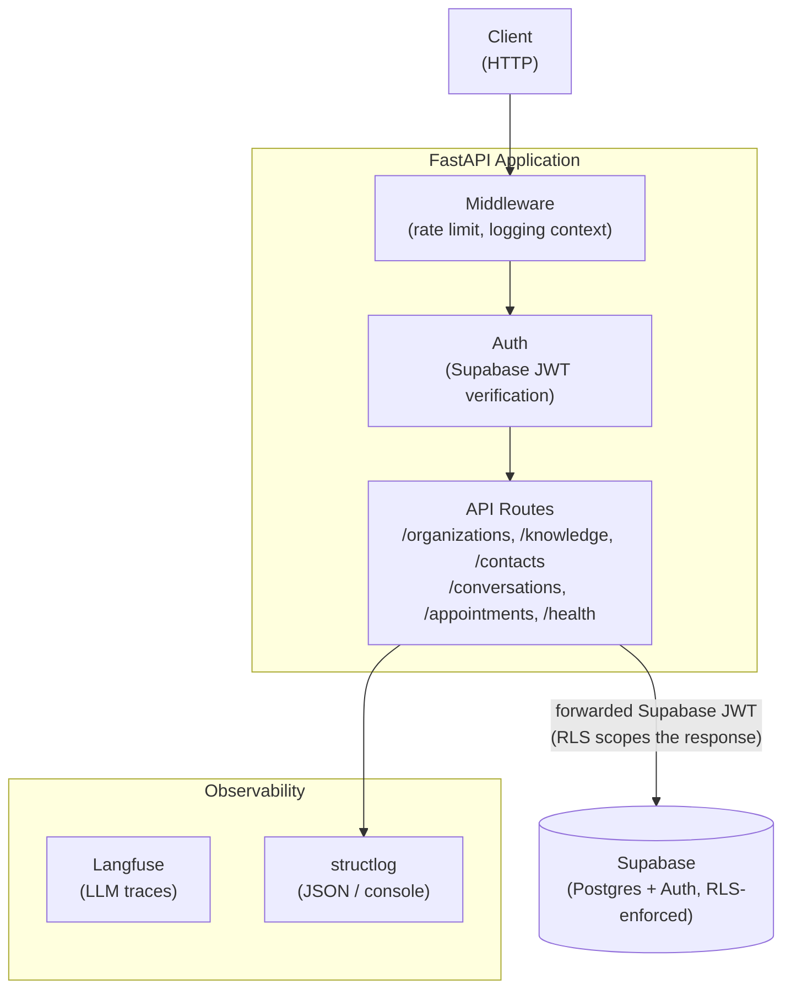
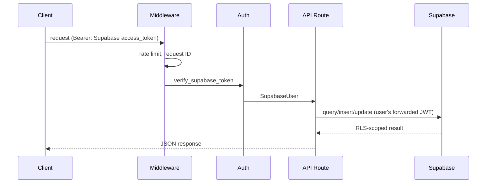
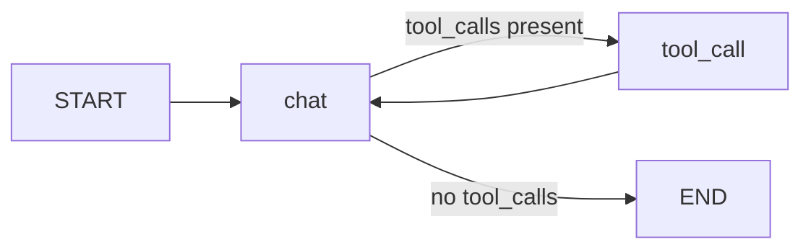

# Architecture

## System overview

The LangGraph agent (below) is kept in the codebase as infra for generating outreach messages later, but isn't wired to an API route yet — nothing in the diagram above currently invokes it.

## Request lifecycle

## LangGraph agent (not yet wired to an endpoint)

The agent is a two-node `StateGraph` in `app/core/langgraph/graph.py`, kept as infra for future outreach message generation:

- **`chat` node** — builds the system prompt, calls the LLM, returns a `Command` routing to `tool_call` or `END`
- **`tool_call` node** — executes all tool calls concurrently, feeds results back to `chat`
- **Checkpointer** — `AsyncPostgresSaver` persists the full `GraphState` per `thread_id`, enabling resume on interrupts and multi-turn conversation history — creates its own tables in the Supabase Postgres project once used

## Key design decisions

**Tool calls execute concurrently.** When the LLM returns multiple tool calls in one response, they all execute in parallel via `asyncio.gather`.

**System prompt cached at module load.** `system.md` is read once at startup. Per-request cost is only `.format()` with the user's name and current datetime — no file I/O.

**LLM fallback is time-bounded.** The entire fallback loop (retries × models) is wrapped in `asyncio.wait_for(timeout=LLM_TOTAL_TIMEOUT)` to prevent indefinite hangs.

## Component responsibilities

| Component | File | Responsibility |
|---|---|---|
| LangGraph Agent | `app/core/langgraph/graph.py` | Orchestrates the conversation loop (not yet wired to a route) |
| LLM Service | `app/services/llm/` | Model registry, retries, circular fallback, structured output |
| Middleware | `app/core/middleware.py` | Logging context |
| Auth | `app/api/v1/auth.py` | Supabase JWT verification (`get_current_user`) |
| Supabase Client | `app/services/supabase_client.py` | RLS-scoped and service-role client factories for all product-domain data access |
