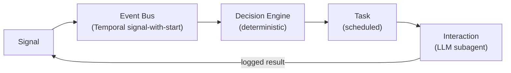

# Architecture

Mirenta runs on the **Mirenta Runtime** — an event-driven, durable-workflow architecture for agent work that spans days to weeks across voice and SMS. LLMs touch only the conversation surface; everything that decides _when, whether, and on what channel_ to act is deterministic code. That split is what makes long-running, multi-channel outreach predictable and auditable.

> **Implementation status.** The full Temporal-driven loop — signal ingestion, the event bus (Temporal signal-with-start), the deterministic decision engine, durable task scheduling, and the interaction layer — runs end-to-end for **SMS**, including knowledge-grounded compose and a 3-day silence follow-up that cancels on inbound. **LiveKit voice** (`livekit_agent/`) runs standalone (console / Agent Console / WebRTC) with optional Mirenta bootstrap/finalize, and inbound Twilio PSTN calls are now bridged into it via a LiveKit Cloud SIP trunk (`app/api/routers/voice.py::receive_twilio_call` dials `<Dial><Sip>` when `LIVEKIT_SIP_URI` is configured; falls back to reject TwiML otherwise). Outbound calling (the `call` task type) is not implemented — `TaskExecutionWorkflow` still rejects any non-`sms` task. Proactive/first-touch outreach is not implemented yet. See [Component status](#component-status) for the precise breakdown.

## The loop

1. A **Signal** arrives (inbound webhook, reply, or a completed interaction re-entering the loop).
2. It's published to an **event bus**, partitioned by `contact_id` so one contact's events always process in order.
3. The **decision engine** — pure deterministic code, no LLM calls — reads the signal plus contact state and emits zero or more **tasks**.
4. The **task scheduler** durably fires each task at its scheduled time, minutes to weeks out.
5. The **interaction layer** runs an LLM subagent for that task on its channel, then logs the result and re-publishes it as a new `interaction_result` signal — closing the loop.

## Components

### 1 · Signal ingestion

FastAPI webhook routers normalize inbound events into the canonical `Signal` schema (`app/schemas/signals.py`, `signals` table) and hand them to the event bus. All HTTP routes are mounted under `API_PREFIX` (default `/api`). `POST /api/webhooks/twilio/sms` (`app/api/routers/signals.py`) verifies the Twilio request signature, resolves the sending org via `organizations.phone` and the contact via `contacts.phone`, records the `inbound_sms` signal, and either handles STOP/START keywords synchronously (`app.services.sms_interaction.handle_sms_keyword_fastpath`) or hands off to the contact's `ContactLoopWorkflow`. `dedup_key` rejects provider webhook replays at the edge — see the `signals` unique constraint in `supabase/migrations/0004_signals.sql`.

`POST /api/webhooks/twilio/voice` (`app/api/routers/voice.py`) is the voice webhook set on newly provisioned org numbers. It verifies the signature, resolves org/contact, records an `inbound_call` signal for audit, then — when `settings.LIVEKIT_SIP_URI` is configured — dials the call into the LiveKit Cloud SIP trunk (`<Dial><Sip>`, correlation ids carried as `X-Mirenta-*` SIP headers) so the already-dispatched `mirenta-voice` agent picks it up; falls back to reject TwiML when the SIP bridge isn't configured or the call is blocked. `decision.engine.SIGNAL_HANDLERS` has no `inbound_call` entry — that's deliberate; the loop re-enters only once the LiveKit agent's finalize step emits an `interaction_result` signal.

New organizations get a dedicated Twilio subaccount, US local SMS+voice number, and Messaging Service provisioned automatically at creation (`provision_org_twilio` in `app/services/clients/twilio_client.py`, wired into `POST /api/organizations`) so `organizations.phone` is populated without a manual step. The number's `sms_url` and `voice_url` both point at this API. Public SIDs (`twilio_subaccount_sid`, `twilio_phone_sid`, `twilio_messaging_service_sid`) live on the org row; the subaccount Auth Token is encrypted in service-role-only `organization_twilio_secrets` for webhook signature validation. Outbound SMS prefers the Messaging Service SID. This is best-effort: a Twilio failure doesn't fail org creation. A2P 10DLC Brand/Campaign registration per org is still a follow-up (required before reliable US outbound SMS at scale).

### 2 · Event bus

Temporal **signal-with-start** on the contact's `ContactLoopWorkflow` (`id=f"contact-loop:{contact_id}"`): if the workflow is already running for that contact it's signaled in place, otherwise a new one is started. Signals queue inside the workflow (`ContactLoopWorkflow.signal_received`) and are processed one at a time in arrival order — this is what gives per-contact ordering without a separate message broker.

### 3 · Contact memory

Per-contact state lives in two places, both in the same Supabase Postgres project:

- **`contact_state`** (structured, mutable) — current decision-engine state, `goal`, consent-adjacent counters (`contact_attempts`, `attempts_window_start`), `next_task_at`, and the running `temporal_workflow_id`. This is what the decision engine reads on every signal.
- **`contact_memory`** (semantic) — embedded chunks (summaries, extracted facts, transcript excerpts) with pgvector HNSW recall via the `match_contact_memory` RPC (`supabase/migrations/0007_memory.sql`). Rolling summaries also get mirrored onto `contact_state.memory_summary` for cheap injection into agent context without a vector query.

Every decision reads from this state; every interaction writes back to it. This is what gives the agent continuity across weeks of touchpoints.

### 4 · Decision engine (deterministic core)

A rules engine in `decision/` — **not an LLM**, and with zero imports from `app/core/langgraph/` (see AGENTS.md's deterministic-core invariant). `evaluate(signal, contact, contact_state, consent, now)` (`decision/engine.py`) dispatches on `signal.type` to a handler in `decision/rules.py` and always emits the same `tasks` for the same inputs.

**Only two signal types are handled today:**

| `signal.type` | Handler | Behavior |
|---|---|---|
| `inbound_sms` | `decide_on_inbound_sms` | Runs the hard guardrails, then emits one `sms` reply task scheduled immediately (quiet hours do not defer inbound replies); also cancels any pending `follow_up_no_response` |
| `interaction_result` | `decide_on_interaction_result` | Folds the outcome into `contact_state` (`opted_out` / `goal_achieved` / `active`); after a successful non-follow-up SMS, emits one `follow_up_no_response` SMS task scheduled 3 days out (quiet-hours deferred). A later inbound cancels any still-scheduled follow-up. |

Every other `signal.type` (`webhook`, `inbound_call`, `portal_event`, `manual`) is a no-op — `evaluate()` returns an empty `DecisionOutput`. Two consequences worth knowing:

- **No proactive/first-touch outreach.** Every task today is still emitted in response to an existing inbound or a completed interaction — nothing cold-starts contact with someone who hasn't signaled yet.
- **Follow-up supersession is implemented for the 3-day silence nudge.** An inbound SMS sets `cancel_scheduled_follow_ups`, which marks pending `follow_up_no_response` tasks `canceled`; `TaskExecutionWorkflow` re-checks status after its sleep and exits without sending.

Compliance guardrails (`decision/guardrails.py`) are hard preconditions, not filters applied later: contact-frequency caps, DNC (`contacts.status = 'dnc'`), and the `current_consent` view (per-channel, latest-decision-wins — see `supabase/migrations/0003_contacts.sql`). Quiet-hours deferral helpers exist for future proactive/outbound outreach but are not applied to inbound replies — if someone texts at 1am, we reply at 1am. A task that fails a hard guardrail check is never emitted, and `tasks.idempotency_key` is derived deterministically (`decision/idempotency.py`) so retries can't double-emit it.

### 5 · Task scheduler

Durable delayed execution via **Temporal** (`workflows/`) — one long-running `ContactLoopWorkflow` per contact, with a child `TaskExecutionWorkflow` per emitted task (`parent_close_policy=ABANDON`, so a task keeps running to completion independent of what else happens to the contact afterward). `TaskExecutionWorkflow` sleeps on a durable timer until `scheduled_for`, then **re-checks guardrails** (DNC, consent, frequency cap) and task status (so a follow-up canceled by a later inbound exits without sending) before doing anything, so a compliance change made while the task was sleeping still blocks the send. The `tasks` table (`supabase/migrations/0005_tasks.sql`) is the durable, queryable record — `temporal_workflow_id`/`temporal_run_id` link a row back to its workflow, `idempotency_key` guarantees a retried activity never double-sends, and `guardrail_result` records the precondition checks re-evaluated at execution time.

**Only `task.type == "sms"` actually executes.** Any other task type (`call`, `webhook`, `api_call`) hits `TaskExecutionWorkflow`'s type check and is marked `status="failed"` immediately — there's no send-side implementation for those channels yet (see §6).

Run the worker with `make worker` (registers `ContactLoopWorkflow` + `TaskExecutionWorkflow` and their activities — see `worker/main.py`); `make temporal-up` starts a local Temporal server + UI via `docker-compose.yml` for development.

### 6 · Interaction layer (LLM subagents)

Channel-specific conversation surfaces. There are **two entry points** into this layer — the invariant that actually matters, per AGENTS.md, is that `decision/` never imports from `app.core.langgraph`, not that exactly one file does:

- `activities/interactions.py`'s `run_interaction` Temporal activity, for **scheduled SMS tasks** — one activity call per complete SMS exchange (LangGraph `sms_graph.py`).
- `livekit_agent/` (LiveKit Cloud Agents worker), for **voice sessions** — native LiveKit `AgentSession` (Deepgram STT/TTS + OpenAI LLM) via console / Agent Console / WebRTC, or dispatched onto a real inbound Twilio call via the LiveKit SIP trunk; not a Temporal activity either way.

**SMS (`app/core/langgraph/sms_graph.py`)** — a `compose → output_guardrails` loop: `compose` drafts a reply with the LLM (`app/core/langgraph/nodes/compose.py`), grounding on active org `knowledge` rows fetched by `activities/interactions.py` via `app/services/knowledge.py` and injected as a system message; `output_guardrails` deterministically checks it (max length, required "STOP" opt-out language, prohibited-claim keywords, PII patterns — `app/core/langgraph/nodes/output_guardrails.py`) and either passes it through, sends it back to `compose` with feedback (up to `MAX_GUARDRAIL_ATTEMPTS`), or escalates to a human. State is checkpointed via `AsyncPostgresSaver` keyed on `thread_id = f"sms:{org_id}:{contact_id}"`, so the LLM sees prior turns on the next inbound message. Every call is traced via the Langfuse `CallbackHandler`. The system prompt itself is a Jinja2 template (`app/core/prompts/sms.md`, rendered via `load_sms_prompt()` in `app/core/prompts/__init__.py`).

**Voice (LiveKit Cloud agent)** — runs outside Temporal, whether the session comes from a real Twilio call or from console/Agent Console/WebRTC. Local `make voice-agent-console` / `make voice-agent-dev` and LiveKit Agent Console use a playground persona. A real inbound call is dialed by Twilio into the LiveKit SIP trunk (see [Signal ingestion](#1--signal-ingestion)); the agent (`livekit_agent/src/agent.py`) detects the SIP participant and polls for Mirenta correlation ids delivered as SIP INVITE headers. Either way, when a session supplies Mirenta correlation metadata, the worker calls `POST /api/internal/voice/bootstrap` for instructions + org knowledge and `POST /api/internal/voice/finalize` on shutdown to log the interaction and re-enter `ContactLoopWorkflow`. `bootstrap_voice_session` (`app/api/routers/voice.py`) renders the spoken instructions and opening greeting from Jinja2 templates (`app/core/prompts/voice.md`, `voice_greeting.md`, via `load_voice_prompt()`/`load_voice_greeting()`), fetching the org's `name` from Supabase so the greeting introduces itself as "the AI receptionist for {org name}" rather than a generic persona. Deepgram STT → OpenAI LLM → Deepgram TTS with LiveKit barge-in/VAD owns the duplex session throughout.

**Why a live duplex session can't be a Temporal activity the way an SMS task is:** Temporal's activity model is "one bounded call in, one result out." A voice session is long-lived duplex audio. LiveKit Agents own that session; Temporal only sees a terminal interaction result when finalize runs.

A crash between hangup and finalize completing can lose that one interaction's logging/loop re-entry — an accepted gap for this pass, since the live session itself is already lost on crash regardless.

Every completed interaction is written to `interactions` (`supabase/migrations/0006_interactions.sql`) via the `log_interaction` activity, and `emit_interaction_result_signal` (`activities/logging.py`) writes a new `interaction_result` signal and delivers it via Temporal **signal-with-start** (not a plain signal on an existing handle — a first-ever inbound from a brand-new contact has no `ContactLoopWorkflow` running yet) — this is what actually closes the loop for SMS (and for voice sessions that finalize).

The `contact_timeline` view merges `signals`, `tasks`, and `interactions` into one chronological feed per contact (`GET /api/organizations/{org_id}/contacts/{id}/timeline`), so reconstructing "everything that's happened with this contact" doesn't require querying three tables separately.

## Key design principles

- **Deterministic core, generative edge.** The decision engine has zero LLM calls and zero imports from the agent layer. Same inputs → same tasks, always. This is the predictability and audit guarantee the whole architecture is built around.
- **Compliance as preconditions, not filters.** Guardrails gate task _emission_ in the decision engine and are re-checked at _execution_ time (`tasks.guardrail_result`) — a non-compliant contact attempt is structurally impossible, not just discouraged. Consent is append-only (`consent` table, never updated in place — revoke is a new row) so the compliance trail can't be silently rewritten.
- **Everything is a Signal.** Inbound webhooks, replies, and completed interactions all re-enter through the same `signals` table and the same decision-engine entry point, so one code path handles the entire contact lifecycle from first touch to opt-out.
- **Full provenance.** Every task records the signal that caused it (`caused_by_signal_id`); every interaction records its task (`task_id`) and emits a result signal (`result_signal_id`) — an unbroken audit chain per contact, queryable via `contact_timeline`.

## Reference stack

| Layer                      | Technology                                                                     | Status                                                                                                       |
| --------------------------- | ------------------------------------------------------------------------------ | -------------------------------------------------------------------------------------------------------------------------------------------- |
| Signal ingestion           | FastAPI webhook routers → canonical `Signal`                                   | SMS done (`receive_twilio_sms`); voice webhook bridges to LiveKit SIP when configured, else reject-only (`receive_twilio_call`) |
| Event bus                  | Temporal signal-with-start, partitioned per contact                            | Done                                                                                                          |
| Orchestration / scheduling | Temporal (one long-running workflow per contact; timers; child task workflows) | Done for SMS — `workflows/contact_loop.py`, `workflows/task_execution.py`, `worker/main.py`. LiveKit voice runs outside Temporal (see §6); only finalize re-enters it |
| Decision engine            | Pure Python rules + guardrails (runs inside workflow code)                     | Done for `inbound_sms`/`interaction_result` (incl. 3-day silence follow-up + cancel-on-inbound); no proactive/first-touch outreach yet |
| Subagents                  | LangGraph (SMS) + LiveKit Agents (voice)                                   | SMS done (`sms_graph.py`, knowledge-grounded, Temporal activity); voice agent (`livekit_agent/`, Deepgram+OpenAI) reachable via console/WebRTC and real Twilio PSTN calls (LiveKit SIP trunk) |
| State + memory             | Supabase Postgres (+ pgvector for semantic recall)                             | Done — `contacts`, `contact_state`, `consent`, `signals`, `tasks`, `interactions`, `contact_memory`, plus dashboard-facing `profiles`, `organizations`, `knowledge` |
| Schemas                    | Pydantic models shared across API, workflows, and agents                       | Done — `app/schemas/`                                                                                        |

## Component status

| Component                                  | File(s)                                                                    | State                                                                 |
| ------------------------------------------ | -------------------------------------------------------------------------- | ---------------------------------------------------------------------- |
| Signal schema + table                      | `app/schemas/signals.py`, `supabase/migrations/0004_signals.sql`           | Implemented                                                            |
| Twilio SMS webhook                         | `app/api/routers/signals.py::receive_twilio_sms`                          | Implemented                                                            |
| Twilio voice webhook (SIP bridge)          | `app/api/routers/voice.py::receive_twilio_call`                           | Implemented — audit signal, then dials into the LiveKit SIP trunk (`generate_voice_dial_twiml`) when `LIVEKIT_SIP_URI` is set; reject TwiML fallback otherwise |
| LiveKit Cloud voice agent                  | `livekit_agent/`                                                          | Implemented — Deepgram STT/TTS + OpenAI LLM; reachable via console/Agent Console/WebRTC and real Twilio PSTN calls through the LiveKit SIP trunk; optional bootstrap/finalize |
| Contact state + consent                    | `app/schemas/contacts.py`, `supabase/migrations/0003_contacts.sql`         | Implemented                                                            |
| Task schema + table                        | `app/schemas/tasks.py`, `supabase/migrations/0005_tasks.sql`               | Implemented                                                            |
| Interaction schema + table + timeline view | `app/schemas/interactions.py`, `supabase/migrations/0006_interactions.sql` | Implemented                                                            |
| Contact memory + semantic recall RPC       | `app/schemas/memory.py`, `supabase/migrations/0007_memory.sql`             | Implemented                                                            |
| Temporal client + worker                   | `app/services/clients/temporal_client.py`, `worker/main.py`                       | Implemented                                                            |
| Decision engine                            | `decision/engine.py`, `decision/rules.py`, `decision/guardrails.py`        | Implemented for `inbound_sms` + `interaction_result` (incl. 3-day silence follow-up); no first-touch/proactive rules yet |
| `ContactLoopWorkflow` / `TaskExecutionWorkflow` | `workflows/contact_loop.py`, `workflows/task_execution.py`            | Implemented for the `sms` task type; cancels superseded follow-ups on inbound; LiveKit voice doesn't use `TaskExecutionWorkflow` (see §6) |
| SMS subagent                               | `app/core/langgraph/sms_graph.py`, `nodes/compose.py`, `nodes/output_guardrails.py` | Implemented — grounds replies on `knowledge` |
| Knowledge base                             | `supabase/migrations/0008_knowledge.sql`, `app/services/knowledge.py`, `app/api/routers/knowledge.py` | Implemented — CRUD + SMS/voice prompt injection |
| Profiles + org list (dashboard bootstrap)  | `app/api/routers/profiles.py`, `organizations.py::list_organizations` | Implemented — `GET`/`PATCH /profiles/me`; `GET /organizations` lists the caller's memberships |
| Voice LangGraph (legacy)                   | `app/core/langgraph/voice_graph.py`, `nodes/voice_compose.py`, `nodes/voice_output_guardrails.py` | Present but unused on the live call path (LiveKit native LLM owns turns) |
| Org phone auto-provisioning                | `app/services/clients/twilio_client.py::provision_org_twilio`                    | Implemented — per-org subaccount + Messaging Service + number; A2P Brand/Campaign registration not yet automated |
| Outbound call placement                    | —                                                                          | Not started (`TaskType.call` exists in the schema; `TaskExecutionWorkflow` rejects any non-`sms` task) |
| Task cancellation on signal supersession   | `decision/rules.py`, `activities/contact_store.py::cancel_scheduled_follow_ups` | Implemented for `follow_up_no_response` tasks superseded by inbound SMS |
| Proactive/first-touch outreach             | —                                                                          | Not started                                                            |
| Auto-follow-up after silence               | `decision/rules.py::decide_on_interaction_result`                          | Implemented — one 3-day SMS follow-up after a successful non-follow-up interaction |
| Voice opt-out handling                     | —                                                                          | Not started — no spoken-STOP-equivalent classification during a call   |

## Component responsibilities

| Component        | File                                       | Responsibility                                                                                        |
| ----------------- | ------------------------------------------- | -------------------------------------------------------------------------------------------------------- |
| Decision engine   | `decision/engine.py`, `decision/rules.py`   | `(signal, contact_state) -> tasks`; pure, no LLM calls, no `app.core.langgraph` imports                  |
| Guardrails        | `decision/guardrails.py`                    | DNC, consent, frequency cap (hard blocks); quiet-hours helpers reserved for future outbound outreach      |
| Contact loop      | `workflows/contact_loop.py`                 | One durable workflow per contact; queues + processes signals in order, runs the decision engine           |
| Task execution    | `workflows/task_execution.py`               | Sleeps until due, re-checks guardrails, runs the interaction, logs the result, closes the loop             |
| SMS subagent      | `app/core/langgraph/sms_graph.py`           | `compose -> output_guardrails` loop for drafting/validating outbound SMS; grounds on org `knowledge` |
| Knowledge         | `app/services/knowledge.py`, `app/api/routers/knowledge.py` | Per-org facts CRUD (RLS) + fetch/format for SMS/voice prompt injection |
| LiveKit voice agent | `livekit_agent/`                          | Cloud-hosted Deepgram+OpenAI voice pipeline; SIP-participant detection + correlation-id polling for real calls; optional Mirenta bootstrap/finalize HTTP bridge |
| LiveKit client    | `app/services/clients/livekit_client.py`    | Reserved — SIP trunk/dispatch rule are cloud resources managed via `lk` CLI (`livekit_agent/sip/`), not application code |
| Channel agent base | `app/core/langgraph/base.py`               | Shared connection pool, checkpointer, chat/tool-call plumbing for channel subagents                        |
| LLM service       | `app/services/llm/`                         | Model registry, retries, circular fallback, structured output                                              |
| Twilio client      | `app/services/clients/twilio_client.py`            | Per-org subaccount/Messaging Service provisioning (SMS + voice webhooks), outbound SMS (MS SID preferred), voice webhook TwiML — dial into LiveKit SIP trunk or reject |
| Temporal client    | `app/services/clients/temporal_client.py`          | Cached workflow client, shared by the API (signal-with-start) and the worker                               |
| Middleware        | `app/core/middleware.py`                    | Logging context                                                                                             |
| Auth              | `app/api/routers/auth.py`                   | Supabase JWT verification (`get_current_user`)                                                             |
| Supabase client    | `app/services/clients/supabase_client.py`          | RLS-scoped and service-role client factories for all product-domain data access                            |
