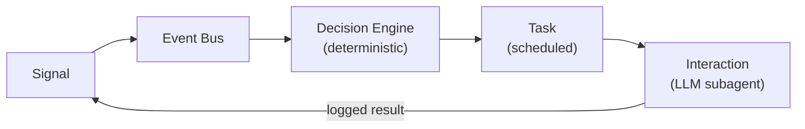
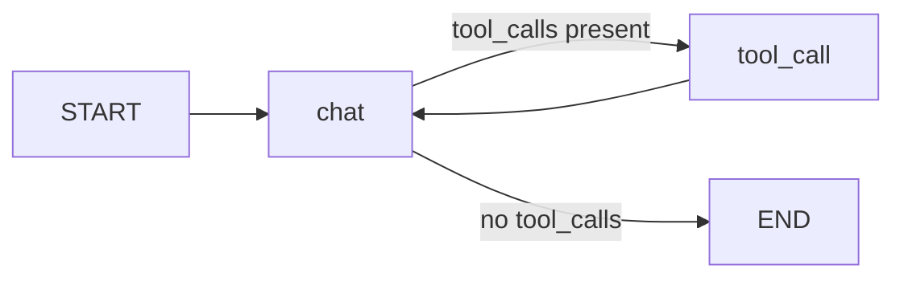

# Architecture

Mirenta runs on the **Takeoff Runtime** — an event-driven, durable-workflow architecture for agent work that spans days to weeks across voice, SMS, email. LLMs touch only the conversation surface; everything that decides _when, whether, and on what channel_ to act is deterministic code. That split is what makes long-running, multi-channel outreach predictable and auditable.

> **Implementation status.** The data model (`supabase/migrations/0004`–`0007`, `app/schemas/signals.py`, `tasks.py`, `interactions.py`, `memory.py`) is in place. The event bus, decision engine, Temporal workflows, and channel subagents described below are the target design and are still being wired up — see [Component status](#component-status).

## The loop

1. A **Signal** arrives (inbound webhook, reply, or a completed interaction re-entering the loop).
2. It's published to an **event bus**, partitioned by `contact_id` so one contact's events always process in order.
3. The **decision engine** — pure deterministic code, no LLM calls — reads the signal plus contact state and emits zero or more **tasks**.
4. The **task scheduler** durably fires each task at its scheduled time, minutes to weeks out.
5. The **interaction layer** runs an LLM subagent for that task on its channel, then logs the result and re-publishes it as a new `interaction_result` signal — closing the loop.

## Components

### 1 · Signal ingestion

FastAPI webhook routers (Twilio, SendGrids) normalize all inbound events into the canonical `Signal` schema (`app/schemas/signals.py`, `signals` table) and publish to an event bus partitioned by `contact_id`. `dedup_key` rejects provider webhook replays at the edge — see the `signals` unique constraint in `supabase/migrations/0004_signals.sql`.

### 2 · Contact memory

Per-contact state lives in two places, both in the same Supabase Postgres project:

- **`contact_state`** (structured, mutable) — current decision-engine state, `goal`, consent-adjacent counters (`contact_attempts`, `attempts_window_start`), `next_task_at`, and the running `temporal_workflow_id`. This is what the decision engine reads on every signal.
- **`contact_memory`** (semantic) — embedded chunks (summaries, extracted facts, transcript excerpts) with pgvector HNSW recall via the `match_contact_memory` RPC (`supabase/migrations/0007_memory.sql`). Rolling summaries also get mirrored onto `contact_state.memory_summary` for cheap injection into agent context without a vector query.

Every decision reads from this state; every interaction writes back to it. This is what gives the agent continuity across weeks of touchpoints.

### 3 · Decision engine (deterministic core)

A state machine / rules engine — **not an LLM**. Given `(signal, contact_state)` it emits the same `tasks` every time. Compliance guardrails are hard preconditions here, not filters applied later: quiet hours, contact-frequency caps, DNC/`contacts.status = 'dnc'`, and the `current_consent` view (per-channel, latest-decision-wins — see `supabase/migrations/0003_contacts.sql`). A task that fails a guardrail check is never emitted, and `tasks.idempotency_key` is derived deterministically so retries can't double-emit it.

### 4 · Task scheduler

Durable delayed execution via **Temporal** timers — one long-running workflow per contact (`ContactLoopWorkflow`, tracked by `contact_state.temporal_workflow_id`), with child `TaskExecutionWorkflow`s per task. Tasks may fire minutes to weeks out, so schedule state has to survive deploys and restarts, which is the reason a durable-workflow engine is used instead of an in-process scheduler. The `tasks` table (`supabase/migrations/0005_tasks.sql`) is the durable, queryable record of what Temporal has scheduled — `temporal_workflow_id` / `temporal_run_id` link a row back to its workflow, and `idempotency_key` guarantees a retried activity never double-texts a contact. `guardrail_result` records the precondition checks re-evaluated at execution time (see below).

### 5 · Interaction layer (LLM subagents)

Channel-specific LangGraph graphs — voice (LiveKit/Twilio + realtime LLM), SMS, email — invoked from Temporal activities. Each subagent receives contact memory plus a constrained toolset and runs behind output guardrails (content filters, required disclosures, opt-out handling). Every completed interaction is written to `interactions` (`supabase/migrations/0006_interactions.sql`), summarized into `contact_memory`/`contact_state.memory_summary`, and re-published to the bus as a new `interaction_result` signal.

The `contact_timeline` view merges `signals`, `tasks`, and `interactions` into one chronological feed per contact (`GET /contacts/{id}/timeline`), so reconstructing "everything that's happened with this contact" doesn't require querying three tables separately.

## Key design principles

- **Deterministic core, generative edge.** The decision engine has zero LLM calls and zero imports from the agent layer. Same inputs → same tasks, always. This is the predictability and audit guarantee the whole architecture is built around.
- **Compliance as preconditions, not filters.** Guardrails gate task _emission_ in the decision engine and are re-checked at _execution_ time (`tasks.guardrail_result`) — a non-compliant contact attempt is structurally impossible, not just discouraged. Consent is append-only (`consent` table, never updated in place — revoke is a new row) so the compliance trail can't be silently rewritten.
- **Everything is a Signal.** Inbound webhooks, replies, and completed interactions all re-enter through the same `signals` table and the same decision-engine entry point, so one code path handles the entire contact lifecycle from first touch to opt-out.
- **Full provenance.** Every task records the signal that caused it (`caused_by_signal_id`); every interaction records its task (`task_id`) and emits a result signal (`result_signal_id`) — an unbroken audit chain per contact, queryable via `contact_timeline`.

## Reference stack

| Layer                      | Technology                                                                     | Status                                                                                                                                     |
| -------------------------- | ------------------------------------------------------------------------------ | ------------------------------------------------------------------------------------------------------------------------------------------ |
| Signal ingestion           | FastAPI webhook routers → canonical `Signal`                                   | Schema + table done; webhook router (`app/api/routers/signals.py`) not yet implemented                                                     |
| Orchestration / scheduling | Temporal (one long-running workflow per contact; timers; child task workflows) | Not yet implemented — `app/services/temporal_client.py` is a placeholder, `temporalio` isn't yet a dependency                              |
| Decision engine            | Pure Python rules + guardrails (runs inside workflow code)                     | Not yet implemented                                                                                                                        |
| Subagents                  | LangGraph graphs per channel, invoked from Temporal activities                 | Only the generic two-node graph in `app/core/langgraph/graph.py` exists today; channel-specific graphs (SMS/voice/email) not yet split out |
| State + memory             | Supabase Postgres (+ pgvector for semantic recall)                             | Done — `contacts`, `contact_state`, `consent`, `signals`, `tasks`, `interactions`, `contact_memory`                                        |
| Schemas                    | Pydantic models shared across API, workflows, and agents                       | Done — `app/schemas/`                                                                                                                      |

## Component status

Until Temporal and the decision engine land, the pieces that exist serve as the durable record and typed contract for the loop, but nothing yet drives a signal end-to-end automatically:

| Component                                  | File(s)                                                                    | State                                                    |
| ------------------------------------------ | -------------------------------------------------------------------------- | -------------------------------------------------------- |
| Signal schema + table                      | `app/schemas/signals.py`, `supabase/migrations/0004_signals.sql`           | Implemented                                              |
| Contact state + consent                    | `app/schemas/contacts.py`, `supabase/migrations/0003_contacts.sql`         | Implemented                                              |
| Task schema + table                        | `app/schemas/tasks.py`, `supabase/migrations/0005_tasks.sql`               | Implemented                                              |
| Interaction schema + table + timeline view | `app/schemas/interactions.py`, `supabase/migrations/0006_interactions.sql` | Implemented                                              |
| Contact memory + semantic recall RPC       | `app/schemas/memory.py`, `supabase/migrations/0007_memory.sql`             | Implemented                                              |
| Signal webhook router                      | `app/api/routers/signals.py`                                               | Placeholder (empty)                                      |
| Temporal client                            | `app/services/temporal_client.py`                                          | Placeholder (empty)                                      |
| Decision engine                            | —                                                                          | Not started                                              |
| Channel subagents (voice/SMS/email)        | `app/core/langgraph/`                                                      | Only the generic chat/tool-call graph exists — see below |

## Existing LangGraph agent (pre-Takeoff)

The two-node `StateGraph` in `app/core/langgraph/graph.py` predates the Takeoff Runtime split and isn't wired to an API route. It's the starting point the channel subagents (§5 above) will fork from once the interaction layer is built:

- **`chat` node** — builds the system prompt, calls the LLM, returns a `Command` routing to `tool_call` or `END`
- **`tool_call` node** — executes all tool calls concurrently, feeds results back to `chat`
- **Checkpointer** — `AsyncPostgresSaver` persists the full `GraphState` per `thread_id`, enabling resume on interrupts and multi-turn history — creates its own tables in the Supabase Postgres project once used

### Design decisions carried forward

**Tool calls execute concurrently.** When the LLM returns multiple tool calls in one response, they all execute in parallel via `asyncio.gather`.

**System prompt cached at module load.** `system.md` is read once at startup. Per-request cost is only `.format()` with the user's name and current datetime — no file I/O.

**LLM fallback is time-bounded.** The entire fallback loop (retries × models) is wrapped in `asyncio.wait_for(timeout=LLM_TOTAL_TIMEOUT)` to prevent indefinite hangs.

## Component responsibilities

| Component       | File                              | Responsibility                                                                                       |
| --------------- | --------------------------------- | ---------------------------------------------------------------------------------------------------- |
| LangGraph agent | `app/core/langgraph/graph.py`     | Generic conversation loop; will split into per-channel subagents once wired to the interaction layer |
| LLM service     | `app/services/llm/`               | Model registry, retries, circular fallback, structured output                                        |
| Middleware      | `app/core/middleware.py`          | Logging context                                                                                      |
| Auth            | `app/api/routers/auth.py`         | Supabase JWT verification (`get_current_user`)                                                       |
| Supabase client | `app/services/supabase_client.py` | RLS-scoped and service-role client factories for all product-domain data access                      |
| Temporal client | `app/services/temporal_client.py` | _(planned)_ Workflow/task scheduling client                                                          |
