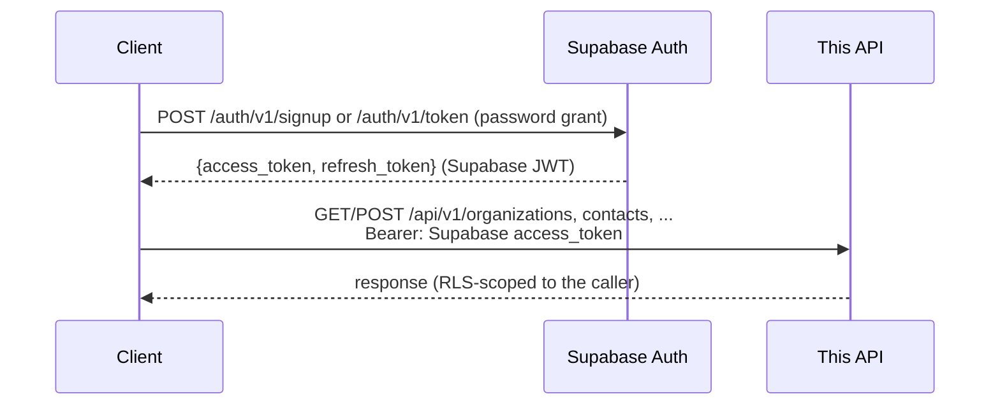

# Authentication

## Flow

User identity is Supabase Auth — clients sign up and log in **directly against Supabase**, not against this backend. This backend only verifies the resulting Supabase JWT.



The Supabase access token identifies the user (`sub` = `auth.users.id`) and is verified locally against the project's public signing keys, fetched from `SUPABASE_JWKS_URL` (`verify_supabase_token` in `app/utils/auth.py`). The same token is forwarded to Supabase's PostgREST layer for every product-domain request, so Row Level Security — not application code — decides what each request can see or change.

This backend never stores a password or issues a user-identity token itself — that's entirely Supabase's responsibility, and there is no separate backend-issued token type.

---

## Sign up / log in — handled by Supabase, not this API

Call Supabase Auth directly (REST API or a Supabase client SDK):

```bash
curl -X POST "$SUPABASE_URL/auth/v1/signup" \
  -H "apikey: $SUPABASE_PUBLISHABLE_KEY" \
  -H "Content-Type: application/json" \
  -d '{"email": "you@example.com", "password": "Secret123!"}'  # pragma: allowlist secret
```

```bash
curl -X POST "$SUPABASE_URL/auth/v1/token?grant_type=password" \
  -H "apikey: $SUPABASE_PUBLISHABLE_KEY" \
  -H "Content-Type: application/json" \
  -d '{"email": "you@example.com", "password": "Secret123!"}'  # pragma: allowlist secret
```

Both return `access_token`/`refresh_token`. Use `access_token` as the Bearer token for every endpoint below.

---

## Product-domain endpoints

`Organization`/`Contact` endpoints (see `app/api/routers/organizations.py`, `contacts.py`) all require a Supabase access token, forwarded to Supabase's PostgREST layer so Row Level Security enforces org-membership authorization — see [Database](database.md#row-level-security) for the policy details.

The agent-loop tables (`signals`, `tasks`, `interactions`, `contact_memory`, `contact_state`, `consent`) are locked to the Supabase service role and aren't reachable through a user-scoped Supabase access token at all — the agent runtime accesses them via `get_service_role_client()`, not the caller's forwarded JWT. See [Database](database.md#row-level-security).

---

## Security notes

- Passwords are never seen or stored by this backend — Supabase Auth owns credential storage and hashing entirely.
- `SUPABASE_JWKS_URL` must point at your Supabase project's JWKS endpoint (Project Settings → API → JWT Keys) — a mismatch causes every token to fail verification.
- All string inputs are sanitised before use.
- Rate limits protect the product-domain endpoints against abuse — see [Configuration](configuration.md#rate-limiting).
