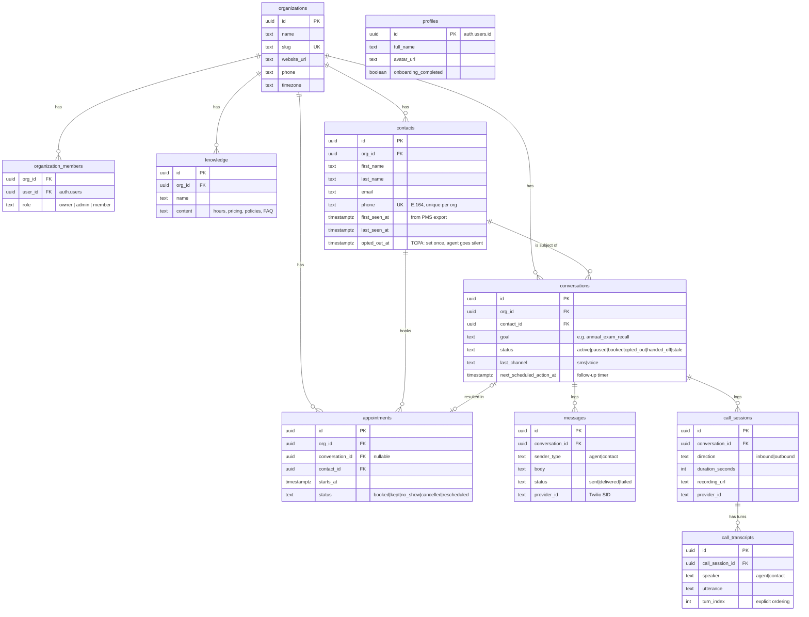

# Database

Everything lives in **one Supabase Postgres project**, entirely as hand-written SQL run through the Supabase SQL editor — this repo has no ORM models and no migration tooling. That covers the Mirenta product domain (clinics, contacts, outreach conversations, SMS/voice logs, and appointments).

User identity (`auth.users`) is owned entirely by Supabase Auth — this repo never creates or migrates a users table. See [Authentication](authentication.md).

The LangGraph agent code (`app/core/langgraph/graph.py`) is kept as infra for future outreach message generation but isn't wired to an endpoint yet. Once it is, its checkpointer will create its own tables (`checkpoints`, `checkpoint_blobs`, `checkpoint_writes`) in this same Postgres project — managed by LangGraph itself, not by this repo.

## Product data model (Supabase)

The Mirenta product itself (clinic dashboard + outreach agent runtime) is backed by hand-written SQL run through the Supabase SQL editor.

### Schema



**`profiles`** — one row per clinic-staff user, 1:1 with `auth.users`, auto-created by the `handle_new_user` trigger on sign-up (copies `full_name` / `avatar_url` from OAuth metadata).

**`organizations`** — a clinic or clinic group. `slug` is unique and used for routing/branding.

**`organization_members`** — join table between `auth.users` and `organizations`, carrying `role` (`owner` / `admin` / `member`). Enforced today: exactly one `owner` per org at creation time (see RLS below).

**`knowledge`** — free-form clinic knowledge (hours, parking, pricing, policies, FAQ answers) the agent draws on when talking to contacts.

**`contacts`** — a pet owner on a clinic's recall list, sourced from the clinic's PMS export. `(org_id, phone)` is unique. `opted_out_at` is a one-way TCPA compliance flag — once set, the agent must go permanently silent for that contact.

**`conversations`** — the session parent: one outreach campaign / logical window of interaction with a contact (e.g. one annual-exam recall attempt). If a contact reactivates and lapses again later, a **new** conversation is opened rather than reusing the old one. A partial unique index enforces at most one `active` conversation per contact at a time.

**`messages`** — the SMS log for a conversation. `provider_id` is the Twilio SID, used to reconcile delivery-status webhooks.

**`call_sessions`** — call-level metadata (direction, duration, recording URL) for voice interactions.

**`call_transcripts`** — per-turn utterances within a call session, explicitly ordered by `turn_index` (not just timestamp) so the dialogue can be replayed deterministically. Unique on `(call_session_id, turn_index)`.

**`appointments`** — the billable outcome. `status = 'kept'` is the event that gets invoiced. `conversation_id` is nullable and `on delete set null` — an appointment survives even if its originating conversation is later removed.

### Unified timeline view

`conversation_timeline` merges `messages` and `call_transcripts` into one chronological feed per conversation, so assembling LLM context on agent wake-up doesn't require querying both tables separately:

```sql
select * from conversation_timeline
where conversation_id = $1
order by occurred_at;
```

It's defined with `security_invoker = true`, so it respects the caller's RLS rather than the view owner's.

### Auto-provisioning & bookkeeping triggers

- **`handle_new_user`** — `security definer` trigger on `auth.users` insert; creates the matching `profiles` row.
- **`set_updated_at`** — generic trigger applied to every table with an `updated_at` column (`profiles`, `organizations`, `organization_members`, `knowledge`, `contacts`, `conversations`, `appointments`); stamps `updated_at = now()` on every update.

### Row Level Security

RLS is enabled on every table. The **agent runtime writes via the Supabase service role key**, which bypasses RLS entirely — so there are no insert/update policies for `conversations`, `messages`, `call_sessions`, or `call_transcripts`. RLS here only governs what the **clinic dashboard** (authenticated end users) can read and manage.

Two `security definer` helper functions back most policies:

- `is_org_member(org)` — is the current user (`auth.uid()`) a member of `org`?
- `is_org_admin(org)` — is the current user an `owner` or `admin` of `org`?

Policy shape by table:

| Table | Select | Insert / Update / Delete |
|---|---|---|
| `profiles` | own row only | own row only (update) |
| `organizations` | org members | any authenticated user can create; admins update; owners delete |
| `organization_members` | org members | first member self-inserts as `owner`; admins add/remove thereafter |
| `knowledge` | org members | admins only |
| `contacts` | org members | admins only |
| `conversations` | org members | dashboard is read-only (writes via service role) |
| `messages` | org members (via parent conversation) | read-only |
| `call_sessions` | org members (via parent conversation) | read-only |
| `call_transcripts` | org members (via parent call session → conversation) | read-only |
| `appointments` | org members | read-only |

### Indexes

- `messages (conversation_id, created_at)`, `call_sessions (conversation_id, created_at)`, `call_transcripts (call_session_id, turn_index)` — timeline reconstruction.
- `conversations (next_scheduled_action_at) where status = 'active'` — the timer loop's "what's due for follow-up" query.
- `contacts (phone)` — inbound SMS/call routing: look up the contact by phone number.
- `contacts (org_id)`, `knowledge (org_id)`, `conversations (org_id, status)`, `conversations (contact_id)`, `appointments (org_id, starts_at)`, `appointments (conversation_id)` — dashboard list views.
- `conversations (contact_id) where status = 'active'` (unique) — enforces one active conversation per contact; drop this if overlapping campaigns are ever needed.

### API access

This backend exposes the product domain via `app/api/v1/organizations.py`, `knowledge.py`, `contacts.py`, `conversations.py`, and `appointments.py`. Every route builds a Supabase client scoped to the caller's forwarded access token (`get_user_client` in `app/services/supabase_client.py`), so RLS — not application code — decides what each request can see or change. See [Authentication](authentication.md#product-domain-endpoints).
