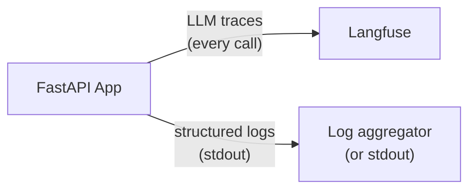
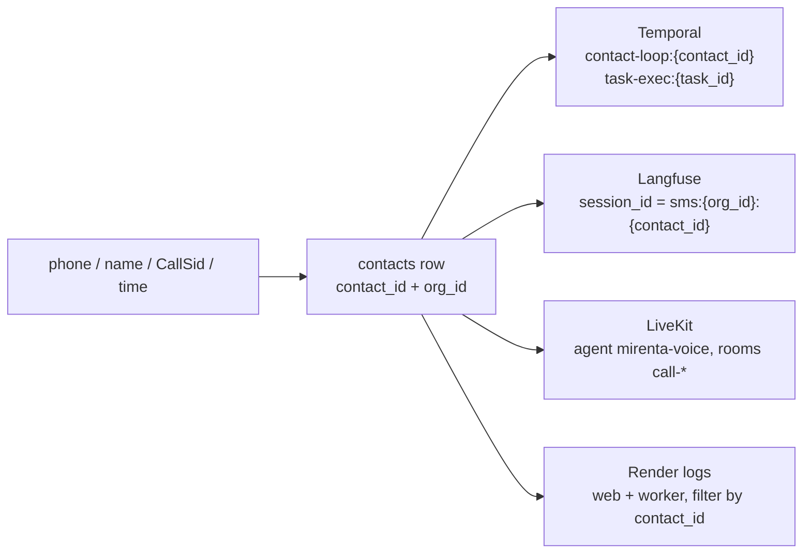

# Observability

## Overview



---

## Langfuse — LLM tracing

Every LLM call is traced via the LangChain `CallbackHandler`. Traces include:

- Input messages and output
- Token usage and cost
- Latency per call and per session
- Model name, temperature, and other parameters

**Setup:**

```bash
LANGFUSE_TRACING_ENABLED=true
LANGFUSE_PUBLIC_KEY=pk-...
LANGFUSE_SECRET_KEY=sk-...
LANGFUSE_BASE_URL=https://cloud.langfuse.com   # or your self-hosted URL
```

**Disable for local dev:**

```bash
LANGFUSE_TRACING_ENABLED=false
```

---

## Structured logging

All logs use [structlog](https://www.structlog.org/) in a consistent format:

- **Development**: coloured console output
- **Production**: JSON (pipe to your log aggregator)

Every log line automatically carries `request_id`, `session_id`, and `user_id` when available — bound by `LoggingContextMiddleware`.

### Log format conventions

```python
# Good
logger.info("chat_request_received", session_id=session.id, message_count=5)

# Never
logger.info(f"chat request received for {session.id}")  # no f-strings
logger.error("something failed", error=str(e))          # use logger.exception for exceptions
```

Rules:

- Event names are `lowercase_with_underscores`
- Variables are keyword arguments, never interpolated into the event string
- Use `logger.exception()` (not `.error()`) when inside an `except` block — preserves the full traceback

### Log levels by environment

| Environment | Level |
| --- | --- |
| development | DEBUG |
| staging | INFO |
| production | WARNING |

---

## Request ID propagation

Every request gets a unique `X-Request-ID` header via [`asgi-correlation-id`](https://github.com/snok/asgi-correlation-id). This ID is:

- Returned in the response headers
- Bound to every log line for that request

Use the `X-Request-ID` from a response to grep logs and look up Langfuse traces for that exact request.

---

## Debugging a live agent session

When a customer reports that a call or SMS misbehaved, the `debug-agent-session` skill (`.agents/skills/debug-agent-session/`) turns a loose report — a phone number, a time window, a Call SID, a contact name — into one `contact_id`/`org_id` and pulls the full cross-system trace. It resolves the session first (`scripts/resolve.py` reads the direct Postgres connection from `.env`), then hands you the exact Temporal, LiveKit, Langfuse, and Render commands with the IDs already filled in.

Correlation model (every system keys off `contact_id`):



Start there rather than hand-querying each system:

```bash
uv run python .agents/skills/debug-agent-session/scripts/resolve.py --phone "+14155550123"
```
